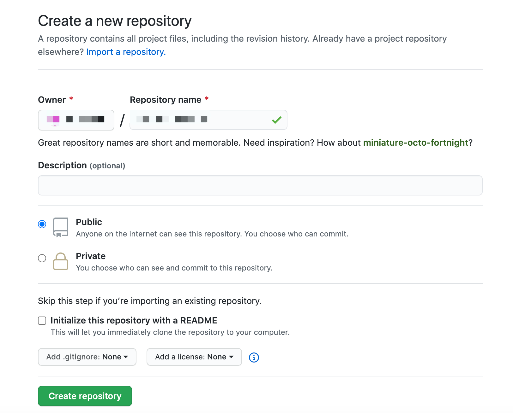
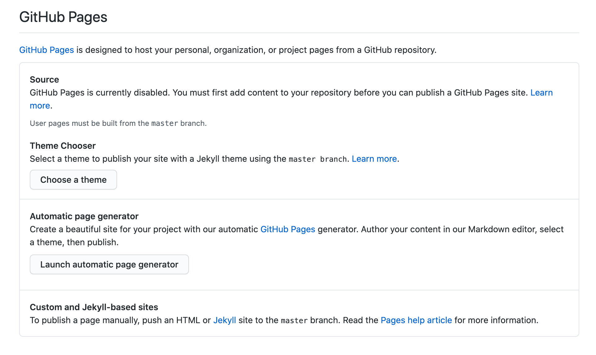
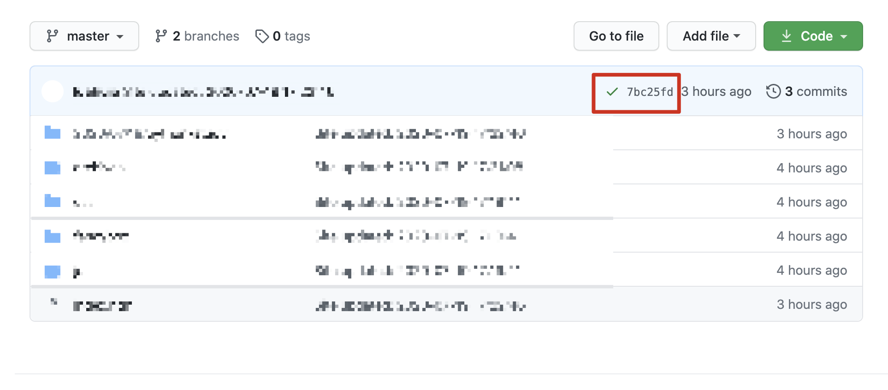

# 写在前面
相对于[GitBook](https://www.gitbook.com/)，GitHub Pages可拓展性更强，搭配Hexo和Action效果极佳~

# 配置GitHub Pages
1. 创建一个新的Repository
<div align="center">
    
</div>
注意：Repository Name需采用固定格式: Github用户名.github.io

2. 配置Repository
<div align="center">
    
</div>
进入Repository主页 -> Settings -> Options -> GitHub Pages

- 配置源
在过去的版本中，我们可以自由指定Source，即指定使用哪个分支的代码来构建博客；然而在新版本中，仅支持通过master的代码来构建博客。

- 配置主题
点击`Choose a theme`，选择心仪的主题。官方提供的Jekyll主题往往不尽如人意，如果你想使用Hexo替代，该步骤随意选择即可。

# 使用简洁高效的Hexo
## 环境准备
- [Node.js](https://nodejs.org/)
- [npm](https://www.npmjs.com/get-npm)

## 集成Hexo
[Hexo](https://hexo.io/)的集成非常简单，主要分为三步:

- 基于模板创建Hexo工程
    - npm install hexo-cli -g
    - hexo init blog
    - cd blog
    - npm install
    - npm install hexo-deployer-git
    - git init
    - git remote add origin 你的Repository地址
    - git checkout -b source

- 配置Hexo工程
    - 修改根目录下的`_config.yml`文件中的`deploy`部分
        ```yml
        ...
        deploy:
        type: git
        repo: 你的Repository地址
        branch: master
        ```
    - 提交源代码
        - git add .
        - git commit -m "First commit"
        - git push origin source:source

- 创建文章并发布
    - hexo new "My first post"
    - hexo clean && hexo g && hexo d

<div align="center">
    
</div>

稍等片刻，待Repository主页提示构建成功后，访问GitHub Pages页面即可看到效果。
😨 Hexo默认样式太丑？
❤️ 没关系！Hexo提供了丰富的[主题样式](https://hexo.io/themes/)和[插件](https://hexo.io/plugins/)，使用者可以自行选择。

## 访问统计
使用[不蒜子](https://busuanzi.ibruce.info/)实现访客人数统计
<div align="center">
    
</div>
在`themes/landscape/layout/_partial/footer.ejs`文件中添加如下代码即可:
```javascript
<script async src="//busuanzi.ibruce.info/busuanzi/2.3/busuanzi.pure.mini.js"></script>
<span id="busuanzi_container_site_pv">
    本站总访问量<span id="busuanzi_value_site_pv"></span>次
</span>
```

## 看板娘
[hexo-helper-live2d](https://github.com/EYHN/hexo-helper-live2d)已做详细说明，本文不再赘述。

# Action实现自动化发布
1. 创建GitHub Token
点击右上角用户头像 -> Settings -> Developer settings -> Personal access tokens -> Generate new token -> 复制token

2. 创建Secrets变量
进入Repository主页 -> Settings -> Secrets -> New secret -> 输入上一步复制的token值并命名为M_GITHUB_PAGES_TOKEN

3. 创建并编辑`.github/workflows/deploy.yml`
```yml
name: Compile and Deploy to GitHub Page
on:
  push:
    branches:
      - source
jobs:
  build:
    runs-on: ubuntu-18.04
    steps:
    - uses: actions/checkout@v2
      with:
        submodules: true
        ref: refs/heads/source

    - uses: actions/setup-node@v1
      with:
        node_version: '8.x'

    - name: Setup Git user info and env
      env:
        M_GITHUB_PAGES_TOKEN: ${{ secrets.M_GITHUB_PAGES_TOKEN }}
      run: |
        git config --global user.email "你的邮箱"
        git config --global user.name "你的用户名"
        sed -i "s/M_GITHUB_PAGES_TOKEN/$M_GITHUB_PAGES_TOKEN/g" ./_config.yml
    - name: Install dependencies
      run: npm ci
    - name: Compile and deploy blog
      run: hexo clean && hexo g && hexo d
```

4. 修改`_config.yml`中的deploy.repo
```yml
...
deploy:
type: git
repo: git@github.com:用户名/用户名.github.io.git
branch: master

👇

...
deploy:
type: git
repo: https://M_GITHUB_PAGES_TOKEN@github.com/用户名/用户名.github.io.git
branch: master
```

⚠️按照[官方文档的描述](https://docs.github.com/en/actions/configuring-and-managing-workflows/authenticating-with-the-github_token#using-the-github_token-in-a-workflow)，GitHub官方提供了一个`GITHUB_TOKEN`变量表示当前的Token值，且支持在workflow中使用。但不幸的是，在实际使用中，该值似乎并没有生效，因此才需要创建上面提到的所谓的`M_GITHUB_PAGES_TOKEN`变量。

# 写在最后
限于篇幅，描述未尽之处，欢迎在评论区留言 :p

# 相关文档
- [Hexo-快速、简洁且高效的博客框架](https://hexo.io/zh-cn/)
- [不蒜子](https://busuanzi.ibruce.info/)
- [hexo-helper-live2d](https://github.com/EYHN/hexo-helper-live2d)